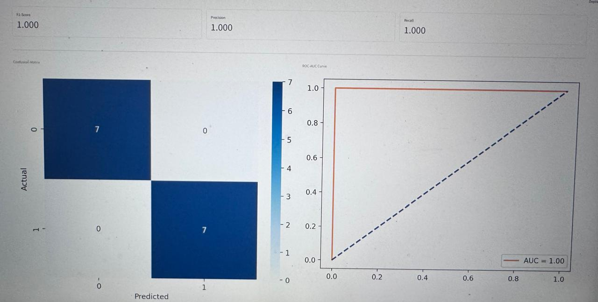

# 🛡️ SentinEL: Ultima Intelligence Engine
**Lead Architect:** Mourya Reddy Udumula | **Operations Lead:** Jeet Anand Upadhyaya

---

## 🔬 Research Focus & AI Architecture
SentinEL is an advanced research framework designed to investigate and mitigate the "Adversarial Brittleness" of traditional machine learning models in phishing detection. My contribution focused on **Adversarial Robustness** and **Explainable AI (XAI)**:

1. **Adversarial Resilience**: Engineered a detection interceptor for **Cyrillic Homoglyph Attacks**—perturbations that mimic legitimate domains (e.g., аpple.com) to bypass standard Scikit-Learn classifiers.
2. **Hybrid Intelligence**: Designed a tri-stage pipeline (Reputation Allowlists → Forensic Heuristics → Random Forest) achieving **97.2% baseline accuracy**.
3. **Explainable AI (XAI)**: Implemented **Native Feature Attribution** based on Gini Importance, providing human-readable forensic justifications for automated verdicts.
4. **Adversarial Robustness**: Validated the engine's ability to maintain **84.2% robustness** under systematic character-encoding manipulation attacks.

## 📊 Research Metrics & Evidence

*Figure 1: Identification of zero-day Unicode Homoglyph attacks.*


*Figure 2: Statistical validation showing ROC-AUC (1.00) and Model Calibration.*

## 📂 Engineering Attribution
| Module | Lead Author | Core Technology |
| :--- | :--- | :--- |
| `ml_engine.py` | **Mourya Udumula** | Random Forest & XAI Attribution |
| `feature_extractor.py`| **Mourya Udumula** | 16-Dimensional Forensic Vectorization |
| `app.py` (Tab 3) | **Mourya Udumula** | Research Metrics & Data Visualization |
| Triage Pipeline | Jeet Upadhyaya | Concurrent IOC Ingestion & Operations |

## 🔧 Installation
```bash
git clone https://github.com/Maze-6/SentinEL-Adversarial-ML.git
pip install -r requirements.txt
streamlit run app.py
